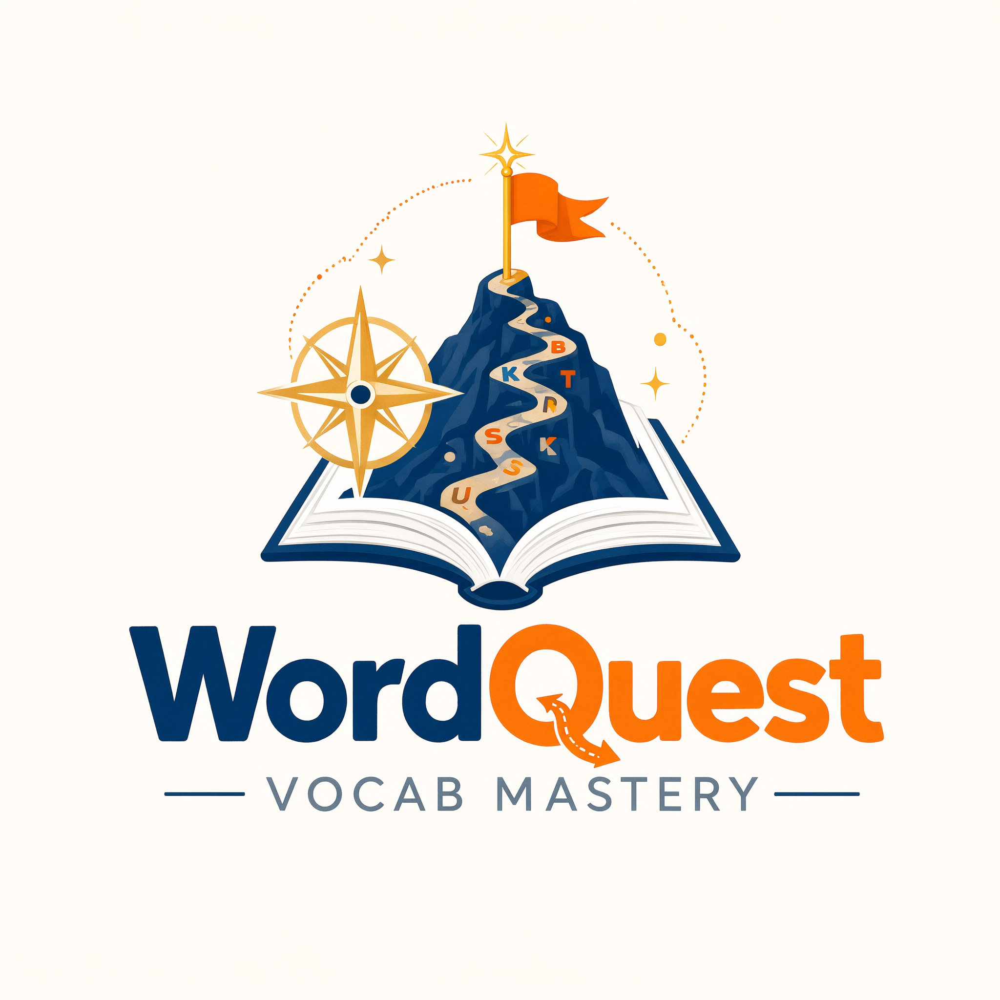

<p align="center">
  
</p>

<h1 align="center">📚 Word Quest</h1>

<p align="center">
  An <strong>offline</strong> vocabulary learning app for Android — pastel, rounded and ad‑free.
  <br/>Word Smart · GRE 333 · Previous‑year bank vocab · One word substitutions · Idioms &amp; Phrases
</p>

<p align="center">
  
</p>

---

## ✨ Features

- **First‑run welcome popup** – asks for your **name** and **gender**; the popup closes automatically after saving.
- **Personal header** – your name and **avatar (depending on gender)** shown at the top of the dashboard.
- **Landing dashboard** – your statistics and a **progress bar for every topic**.
- **Learning section** – a separate section per topic, split **day by day**, with a learning goal of **20 words per day**:
  - Word Smart (793 words)
  - GRE 333 high‑frequency words (406)
  - Important previous‑year bank vocabulary (162)
  - One word substitutions (1,001)
  - Idioms & phrases (475)
- **Exam section** – a separate, **day‑wise exam per topic**; the syllabus is exactly the day’s learning goal.
  - Word Smart exams mix **word meaning, synonym, antonym and fill‑in‑the‑gap** questions.
  - You must score **90% accuracy** per topic per day to unlock the **next day’s learning and exam**.
  - Choose **20, 25 or 30 questions** — the timer runs for **half that many minutes** (20 → 10 minutes).
  - **Randomised on every attempt** (question order and option order).
- **Mistake bank** – wrong answers are saved **separately for each topic** for review and practice.
- **Reset option** – clear learning progress or wipe the profile entirely (with confirmation).
- **About section** – app details and developer information.
- Elegant **pastel theme**, rounded corners, **soft shadows**, light feel — no text‑to‑speech, no network, no ads.

## 📲 Getting the APK

The GitHub Actions workflow ([`.github/workflows/build.yaml`](.github/workflows/build.yaml))
builds the release APK on every push:

1. Open the **Actions** tab of this repository.
2. Select the **Build Android APK** workflow run for `main` (or `workflow_dispatch`).
3. Download the **WordQuest-APK** artifact and install `WordQuest-v1.0.0.apk` on your phone
   (allow “install from unknown sources” when prompted).

The workflow is deliberately kept light so it stays inside GitHub’s free build limits:
`flutter analyze` → `flutter test` → a single release APK, on `ubuntu-latest`.

## 🛠 Building locally

```bash
# requires Flutter 3.24.x (stable) + Java 17
flutter pub get
flutter analyze
flutter test
flutter build apk --release
# APK → build/app/outputs/flutter-apk/app-release.apk
```

## 🧱 Repository layout

```
android/            Android host project (icons generated from logo.png)
assets/
  data/vocab.json   bundled offline word bank (all 5 topics)
  images/logo.png   app logo
  avatars/          gender avatars (from the repository artwork)
lib/                Dart sources (UI + exam engine + offline store)
tool/
  export_vocab.py   rebuilds assets/data/vocab.json from the *.xlsx workbooks
  make_icons.py     rebuilds Android launcher/splash artwork from logo.png
test/               unit tests for the day split & exam engine
Word_Smart_1_All_Vocabularies.xlsx …   source word lists (data of truth)
.github/workflows/build.yaml           GitHub Actions CI → release APK
```

All content ships inside the APK via `assets/data/vocab.json` — the app works
**fully offline**; progress is persisted on the device only.

## ✍️ Author

**Tanvir Rahman** — Barishal, Bangladesh
🟢 Passionate about learning new things · 🟡 Curious mind · 🔵 Loves to travel

## ⚖️ License

MIT — see [LICENSE](LICENSE).
