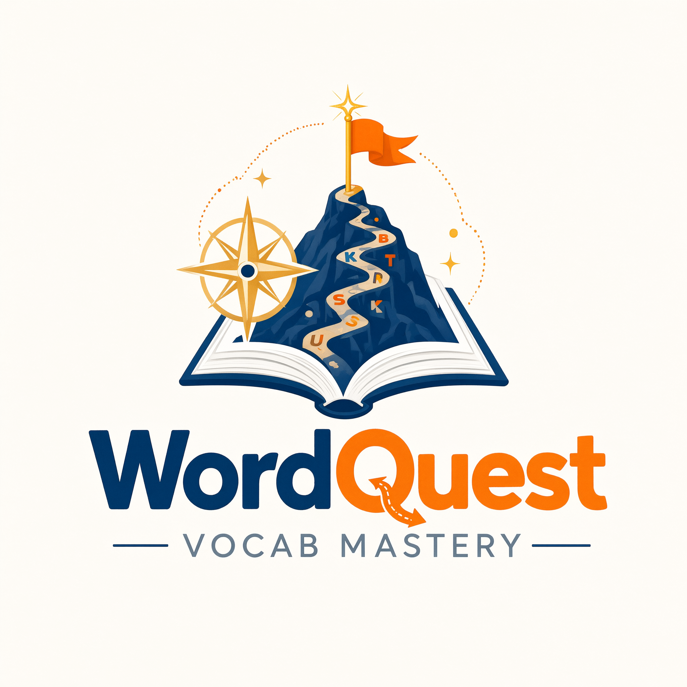

<p align="center">
  
</p>

<h1 align="center">📚 Word Quest</h1>

<p align="center">
  An <strong>offline</strong> vocabulary learning app for Android — pastel, rounded and ad‑free.
  <br/>Word Smart · GRE 333 · Previous‑year bank vocab · One word substitutions · Idioms &amp; Phrases
</p>

<p align="center">
  
</p>

---

## ✨ Features

- **First‑run welcome popup** – asks for your **name** and **gender**; the popup closes automatically after saving.
- **Personal header** – your name and **avatar (depending on gender)** shown at the top of the dashboard.
- **Landing dashboard** – your statistics and a **progress bar for every topic**.
- **Learning section** – a separate section per topic, split **day by day**, with a learning goal of **20 words per day**:
  - Word Smart (793 words)
  - GRE 333 high‑frequency words (406)
  - Important previous‑year bank vocabulary (162)
  - One word substitutions (1,001)
  - Idioms & phrases (475)
- **Exam section** – a separate, **day‑wise exam per topic**; the syllabus is exactly the day’s learning goal.
  - Word Smart exams mix **word meaning, synonym, antonym and fill‑in‑the‑gap** questions.
  - Score **75%** on a day’s exam to unlock the next day **in that topic**. Topics progress independently; other topic goals and marking every word as known are not prerequisites.
  - Choose **20, 25 or 30 questions** — the timer runs for **half that many minutes** (20 → 10 minutes).
  - **Randomised on every attempt** (question order and option order).
- **Mistake bank** – wrong answers are saved **separately for each topic** for review and practice.
- **Reset option** – clear learning progress or wipe the profile entirely (with confirmation).
- **About section** – app details and developer information.
- Elegant **pastel theme**, rounded corners, **soft shadows**, light feel — no text‑to‑speech, no network, no ads.

## 📲 Getting the APK

The GitHub Actions workflow ([`.github/workflows/build.yaml`](.github/workflows/build.yaml))
runs analysis, tests, and an Android build. It uploads a distributable APK only
when persistent Android release signing is configured, so separate CI runs do
not produce APKs with incompatible, temporary debug keys.

To enable signed APK artifacts, add these **GitHub Actions secrets** to the
repository:

- `WORD_QUEST_KEYSTORE_BASE64` — base64-encoded JKS/keystore file
- `WORD_QUEST_KEYSTORE_PASSWORD`
- `WORD_QUEST_KEY_ALIAS`
- `WORD_QUEST_KEY_PASSWORD`

Use the **same private keystore that signed the already-installed app**. The
workflow decodes it only into the runner's temporary directory and publishes
`WordQuest-v1.0.1.apk` as the **WordQuest-APK** artifact. On Linux, encode a
keystore with `base64 -w0 your-release-key.jks`; on macOS, use
`base64 < your-release-key.jks | tr -d '\n'`.

The previous Gradle configuration used Android's debug key for release builds.
Debug keys on local machines or fresh CI runners are not necessarily the same,
so Android can only perform an in-place update when the new APK is signed with
the original install's key. If an old CI signing key is no longer available,
Android cannot accept a replacement signature as an update; do not uninstall
an app whose local data you need. The application ID and SharedPreferences
storage keys are kept stable, and the Android version code is incremented, so
matching-signature upgrades preserve the existing profile and progress.

The workflow remains light: `flutter analyze` → `flutter test` → one Android
release build on `ubuntu-latest`.

## 🛠 Building locally

```bash
# requires Flutter 3.24.x (stable) + Java 17
flutter pub get
flutter analyze
flutter test
flutter build apk --release
# APK → build/app/outputs/flutter-apk/app-release.apk
```

For an update-compatible local release, set `WORD_QUEST_KEYSTORE_PATH`,
`WORD_QUEST_KEYSTORE_PASSWORD`, `WORD_QUEST_KEY_ALIAS`, and
`WORD_QUEST_KEY_PASSWORD` to the same signing key used by the installed app.
Without them, the local release uses the machine's debug key for testing only.

## 🧱 Repository layout

```
android/            Android host project (icons generated from logo.png)
assets/
  data/vocab.json   bundled offline word bank (all 5 topics)
  images/logo.png   app logo
  avatars/          gender avatars (from the repository artwork)
lib/                Dart sources (UI + exam engine + offline store)
tool/
  export_vocab.py   rebuilds assets/data/vocab.json from the *.xlsx workbooks
  make_icons.py     rebuilds Android launcher/splash artwork from logo.png
test/               unit tests for day splits, exams & saved progress
Word_Smart_1_All_Vocabularies.xlsx …   source word lists (data of truth)
.github/workflows/build.yaml           GitHub Actions CI → signed APK (when configured)
```

All content ships inside the APK via `assets/data/vocab.json` — the app works
**fully offline**; progress is persisted on the device only.

## ✍️ Author

**Tanvir Rahman** — Barishal, Bangladesh
🟢 Passionate about learning new things · 🟡 Curious mind · 🔵 Loves to travel

## ⚖️ License

MIT — see [LICENSE](LICENSE).
